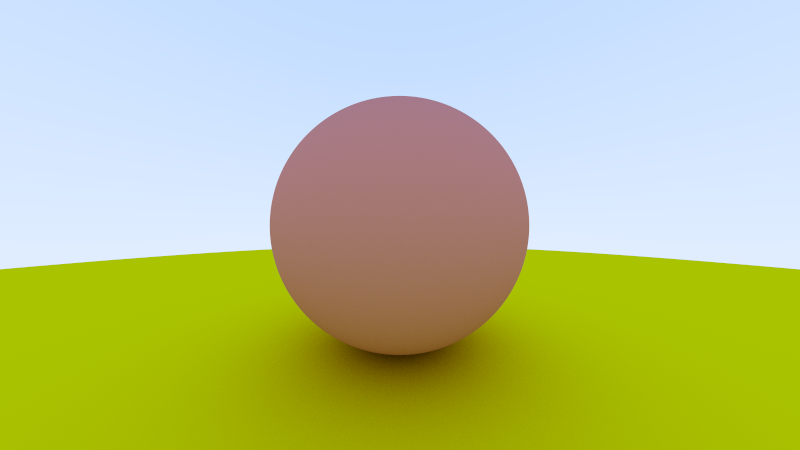

# SimpleRayTracer

🎨 Простой CPU рейтрейсер на C++17: трассировка лучей, многопоточный рендеринг, диффузное освещение и антиалиасинг. От луча до пикселя за 10 секунд.

[English](README.md) | **Русский**

## 🎨 Демонстрация



*Две сферы с диффузным освещением и градиентным небом*

## ✨ Возможности

- ✅ **Трассировка лучей** с пересечением сфер
- ✅ **Многопоточный рендеринг** (использует все ядра CPU)
- ✅ **Антиалиасинг** через случайный сэмплинг (configurable samples per pixel)
- ✅ **Диффузное освещение** с ambient + diffuse компонентами
- ✅ **Градиентное небо** (белый → голубой)
- ✅ **Gamma correction** при выводе
- ✅ **Шаблонные классы** Vec3/Ray для гибкости типов

## 🛠 Технологии

- **C++17** (шаблоны, std::thread, smart pointers)
- **CMake** (кроссплатформенная сборка)
- **PPM формат** (простой текстовый формат изображений)
- **Python + Pillow** (конвертация в PNG)

## 📦 Структура проекта

```
SimpleRayTracer/
├── include/          # Заголовочные файлы
│   ├── Vec3.hpp      # 3D вектор (шаблонный)
│   ├── Ray.hpp       # Луч (origin + direction)
│   ├── Hittable.hpp  # Абстрактный интерфейс для объектов
│   ├── Sphere.hpp    # Сфера (наследует Hittable)
│   ├── World.hpp     # Контейнер объектов сцены
│   ├── Camera.hpp    # Камера с viewport
│   ├── Render.hpp    # Функция трассировки луча
│   └── utils.hpp     # Утилиты (writeColor, gamma)
├── inline/           # Реализации шаблонов
│   ├── Vec3.ipp      # Операторы, dot, cross, normalize
│   └── Ray.ipp       # pointAtParameter
├── src/              # Реализации
│   ├── main.cpp      # Точка входа, многопоточность
│   ├── Sphere.cpp    # Алгоритм пересечения луч-сфера
│   ├── World.cpp     # Поиск ближайшего пересечения
│   └── Render.cpp    # Расчёт цвета пикселя
└── convert.py        # PPM → PNG конвертер
```

## 🚀 Сборка и запуск

### Требования

- **C++17** компилятор (MSVC, GCC, Clang)
- **CMake** 3.15+
- **Python 3** + Pillow (для конвертации в PNG)

### Windows (MSVC)

```powershell
# Установка зависимостей Python
pip install Pillow numpy

# Сборка
cmake -B build
cmake --build build --config Release

# Рендеринг
.\build\bin\Release\SimpleRayTracer.exe

# Конвертация в PNG
python convert.py
```

### Linux/macOS

```bash
# Установка зависимостей
pip3 install Pillow numpy

# Сборка
cmake -B build -DCMAKE_BUILD_TYPE=Release
cmake --build build

# Рендеринг
./build/bin/SimpleRayTracer

# Конвертация
python3 convert.py
```

## ⚙️ Настройки

В `src/main.cpp` можно изменить параметры:

```cpp
const int image_width = 800;           // Ширина изображения
const int image_height = 450;          // Высота изображения
const int samples_per_pixel = 100;     // Сэмплов на пиксель (AA)
```

### Сцена

Добавление объектов в `main()`:

```cpp
World world;
world.add(std::make_shared<Sphere>(Vec3d(0.0, 0.0, -1.0), 0.5));    // Сфера в центре
world.add(std::make_shared<Sphere>(Vec3d(0.0, -100.5, -1.0), 100.0)); // Земля
```

## 📐 Математика

### Пересечение луча со сферой

Решается квадратное уравнение:

```
t² * (d·d) + 2t * d·(o-c) + (o-c)·(o-c) - r² = 0
```

где:
- `d` - направление луча
- `o` - начало луча
- `c` - центр сферы
- `r` - радиус сферы

### Диффузное освещение

```cpp
Vec3d ambient = Vec3d(0.3, 0.3, 0.3);           // Базовое освещение
Vec3d diffuse = 0.7 * (normal + Vec3d(1, 1, 1)) * 0.5;  // Диффузное
return ambient + diffuse;
```

## 🎯 Производительность

**Тестовая сцена** (800x450, 100 samples/pixel):
- **Ryzen 5600X** (12 потоков): ~5-10 секунд
- **Core i5-9400F** (6 потоков): ~15-20 секунд

**Оптимизации:**
- Многопоточный рендеринг (автоматически использует все ядра)
- `lengthSquared()` вместо `length()` где возможно
- Inline функции для векторных операций

## 🔮 Roadmap

- [ ] **Материалы** (металл, диэлектрики, диффузные)
- [ ] **Отражения и преломления** (рекурсивная трассировка)
- [ ] **Другие примитивы** (плоскости, треугольники, меши)
- [ ] **BVH ускорение** для больших сцен
- [ ] **Текстуры и нормал-маппинг**
- [ ] **Depth of field и motion blur**

## 📚 Ресурсы

Проект основан на концепциях из:
- [Ray Tracing in One Weekend](https://raytracing.github.io/) - Peter Shirley
- [Physically Based Rendering](https://www.pbr-book.org/) - Matt Pharr & Greg Humphreys

## 📝 Лицензия

MIT License - делайте что хотите

## 🤝 Вклад

Pull requests welcome! Для крупных изменений сначала откройте issue.

---

**Made with ☕ and ray tracing magic**
